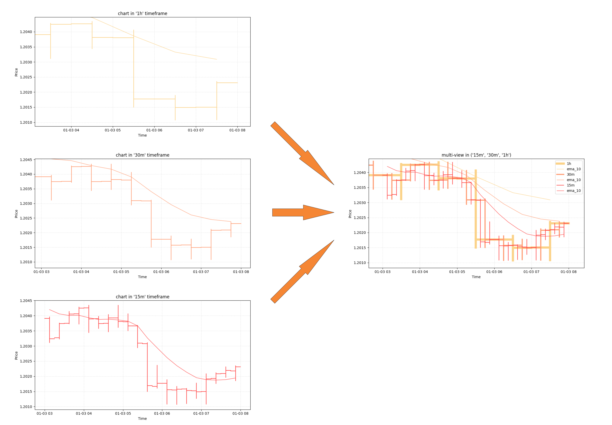
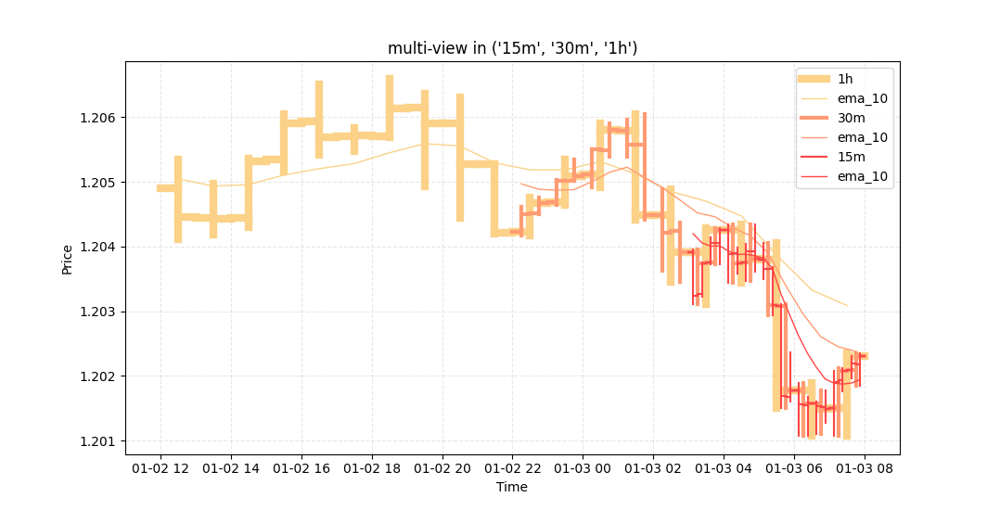

# chart-data-dl

## 📈 Market Chart Data for ML/DL

A toolkit to handle and preprocess financial market chart data for technical analysis, with a focus on preparing input for deep learning and machine learning tasks.

A key feature of this project is its ability to present higher timeframe data (OHLCV values, indicators, etc.) alongside target timeframe data as live data, preventing future information leakage. This supports models and analysts in performing multi-timeframe analysis, enhancing the realism and context-awareness of market predictions and insights.



Here is an example that shows the output as a combination of different timeframes (with optional indicators). The chart demonstrates how different timeframes (e.g., 15m, 30m, 1h) can be displayed together, and how indicators can be overlaid for enriched analysis.



Note: Each dataset within each timeframe maintains the same sequence length, which can be modified through function arguments.

## 🔑 Key Features

**📊 Multi-timeframe datasets**  
Generate synchronized multi-timeframe datasets without future data leakage, compatible with deep learning data loaders (e.g., PyTorch, TensorFlow).

**🗃️ CSV tools for I/O and timeframe conversion**  
Easily import/export datasets in CSV format and convert between timeframes for flexible data handling.

**⚙️ Indicator integration**  
Add technical indicators to datasets, with support for custom indicator development for research and experimentation.

## 🚀 Installation

**📦 Option 1: Install via pip**
```bash
pip install chart-data-dl
```
**🛠 Option 2: Clone and install manually**
```bash
git clone https://github.com/mehranESB/ohlcv-chart-tools.git
cd ohlcv-chart-tools
python setup.py install
```

## 📚 Usage Guide

**1️⃣ Create a Multi-Timeframe Dataset**

This example demonstrates how to create a multi-timeframe dataset, with added indicators like Simple Moving Average (SMA) and Exponential Moving Average (EMA):
```python
import chartDL.indicator as indc
import chartDL.preprocess as pp
import chartDL.utils.csv as csv_utils

# Load the target timeframe data (15-minute)
target_file_path = Path("./DATA/csv/EURUSD-15m.csv")
source_df = csv_utils.import_ohlcv_from_csv(
    target_file_path, header=True, datetime_format="%Y-%m-%d %H:%M:%S"
)

# Define higher timeframes to generate multi-timeframe data (e.g., 30m, 1h)
higher_timeframes = ["30m", "1h"]

# Define the indicators to add to the dataset (e.g., SMA, EMA)
indicators = [indc.SMA(20), indc.EMA(10)]

# Generate the multi-timeframe views, including indicators+
save_path = Path("./DATA/multi_view/EURUSD-15m") # folder where the multi-timeframe data will be saved
mvt_dfs, time_frames = pp.multi_timeframe_view(
    source_df, higher_timeframes, indicators=indicators, save_to=save_path
)
```

**2️⃣ Use with PyTorch DataLoader**

This guide demonstrates how to wrap the `MultiDataset` with PyTorch’s `DataLoader` for model training.

```python
from torch.utils.data import Dataset, DataLoader
from chartDL.dataset import MultiDataset

class CustomDataset(Dataset):
    def __init__(self, dataset: MultiDataset):
        self.dataset = dataset  # store to use it as data source

    def __len__(self):
        return len(self.dataset)

    def __getitem__(self, index):
        multi_time_frame_data = self.dataset[index]

        retrive_data = {}
        for df in multi_time_frame_data:
            name = f"x_{df.attrs['timeframe']}"
            value = df[["High", "Low"]].to_numpy()
            retrive_data[name] = value

        return retrive_data


# Initialize MultiDataset (use your own path and sequence length)
multi_dataset = MultiDataset("./DATA/multi_view/EURUSD-1h", seq_len=128)

# Create a DataLoader for batching and shuffling
data_loader = DataLoader(CustomDataset(multi_dataset), batch_size=64, shuffle=True)

# Iterate through batches during model training
for batch in data_loader:
    ...
```

**🧪 Explore More Utilities**

Check out the `examples/` folder for code samples on:

- Timeframe conversion
- Custom indicator creation
- CSV import/export tools
- Data visualization

## 🤝 Contributing
Contributions are welcome and appreciated!

Feel free to fork the repository, submit pull requests, or open issues for bugs, feature suggestions, or improvements.

## 📄 License
This project is licensed under the MIT License.
See the `LICENSE.txt` file for details.


